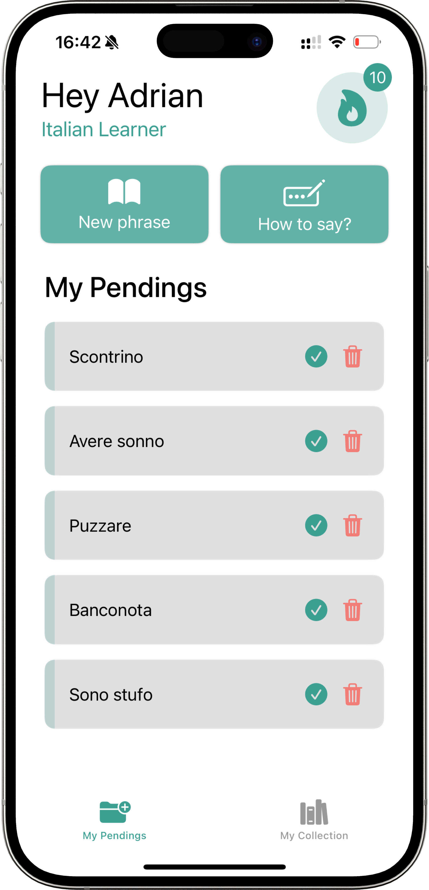
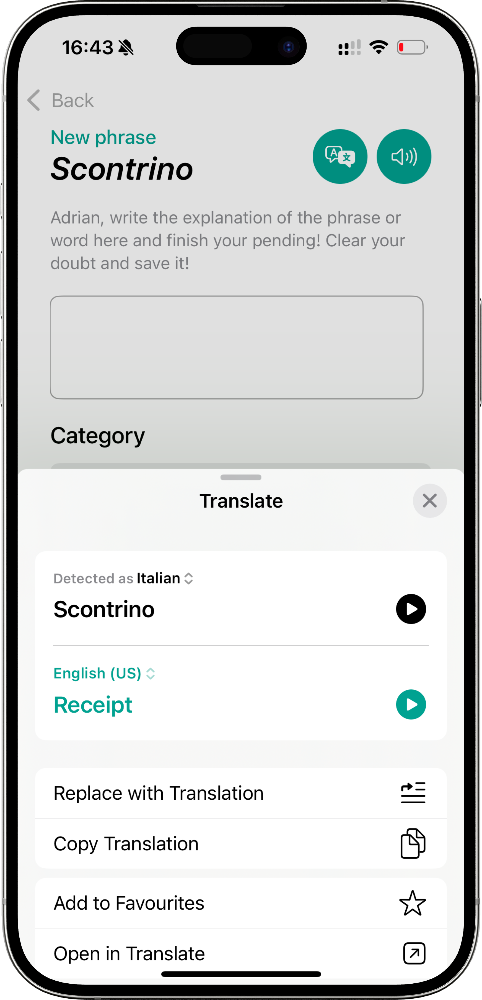

# Lyngo - Challenge 3 

## Description
A simple iOS app that helps users capture, organize, and track words or phrases they encounter while learning a new language, making daily vocabulary growth effortless. 

## Screenshots

## Features
* 📋 **Capture Phrases**: Quickly save words or phrases you encounter in your daily routine to discover the meaning later when you have time.
* 🎙️ **Voice Input**: Add phrases effortlessly using just your voice.
* 🗂️ **Organize by Categories**: Sort and group your entries for easier review.
* 📖 **Track Progress**: Keep a record of what you have learned, ordered by date.
* 🔍 **Add Explanations**: Use the Translation API to add explanations automatically or manually.
* 🛠️ **Widget**: Display words from your collection directly on your home screen for quick reminders.

## Installation
1. Clone this repository: <`git clone https://github.com/fazfaz7/Challenge3`>
2. Open the project in Xcode.
3. Run the app on a simulator or connected device.
